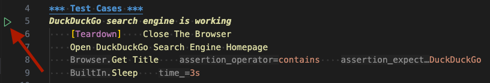

# robotframework-sandbox
Sandbox for QA Assignment using RobotFramework and Playwright.
To use Robot Framework with the Playwright base "[Robot Framework Browser](https://robotframework-browser.org/)" library you need Python and NodeJS, due to Playwright NodeJS being used.
This installation will not interfere with existing Playwright or Robot Framework installation.

## Prerequisites
* [Python (3.8 - 3.12)](https://www.python.org/downloads/) (For macOS strongly recommend [pyenv](https://github.com/pyenv/pyenv) to control which python version is used.)
* [NodeJS >= 18](https://nodejs.org/en/download/prebuilt-installer)
* [VSCode (strongly recommended)](https://code.visualstudio.com/download)
* [RobotCode (VSCode Extension)](https://marketplace.visualstudio.com/items?itemName=d-biehl.robotcode)


## Installation
After installing all requirements listed above, clone this project into a folder or download and extract the repository.
In a Terminal of your choice, navigate to the root directory of that repository where the `bootstrap.py` file is located.

Run the command:
```shell
python bootstrap.py
```

This bootstrap.py does install all needed dependencies into a virtual environment and initializes Browser library into the same directory (.venv) inside of that root directory.
When this script is done, it tells you how to "activate" that virtual environment .

When opening the root directory in VSCode, it normally automatically takes that virtual environment to activate.
If this does not work, press F1 and execute `>Python: Select Interpreter` and select the environment in the `.venv` folder.

## Run
You can run example robot test located in `./tests` folder in two possible ways.
First is via terminal. If you go to your terminal where your virtual environment is activated you can run all robot test files located in `./tests` folder by running:

```shell
robot --outputdir ./results ./tests
```
You can also run tests directly from your IDE if using VSCode with RobotCode plugin.
Open your robot file with the tests you want to execute and on the left side you can see green ▶️ button. If you click it the test will start running if everything is set up correctly.


